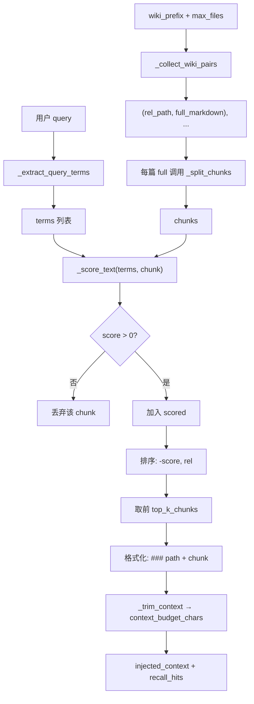
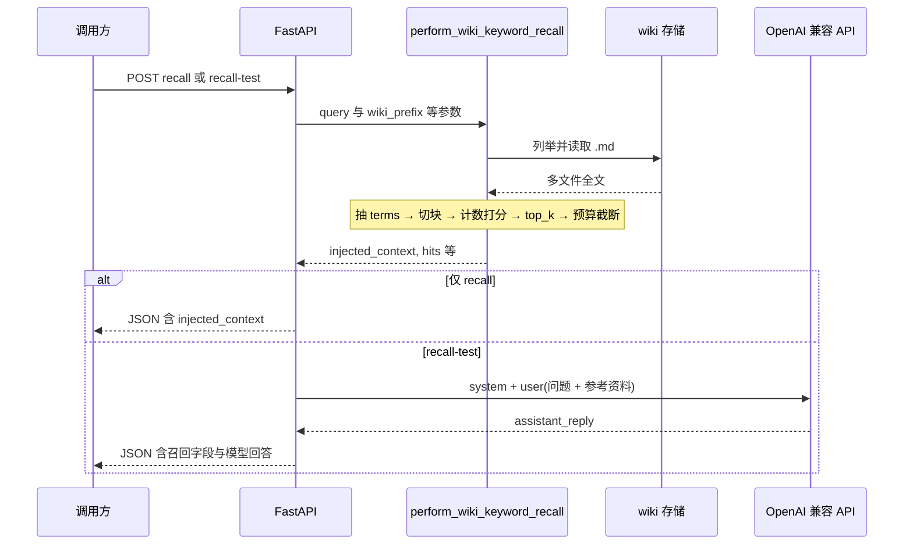

# pathy-knowledge-server

Karpathy 式知识库 **REST** 服务（MVP）：**原始层 raw / 编译层 wiki / 规范层 schema**，OpenAPI 3 + Swagger UI，可选 Bearer 鉴权，OpenAI 兼容 Chat Completions。

## 项目简介

本服务实现「**由 LLM 维护的 Markdown 知识库**」的最小可部署形态：把素材放进原始层，在规范层约定下由 LLM 整理为带结构与交叉引用的编译层 wiki，并通过统一 REST 接口完成读写、编译与维护类任务。适合**本机单机**或**服务器单进程**部署，数据落在进程约定的本地目录，不依赖对象存储。

## 原理

| 概念 | 说明 |
|------|------|
| **原始层 `raw/`** | 未编译或半结构化来源（剪藏、摘录、上传的 Markdown/文本等），作为编译任务的输入。 |
| **编译层 `wiki/`** | 由 LLM 根据原始层与规范生成的 wiki 型 Markdown（索引、条目、交叉引用），编译任务写入目标。 |
| **规范层 `schema/`** | 约束目录、命名与 Agent 行为的说明（如 `AGENTS.md`），供服务与提示词引用；编译 / lint 前会注入或显式引用。 |

**数据流（闭环）**：向原始层写入素材 → 调用编译类接口 → 编译层出现对应条目与索引更新 → 可选 lint/报告类任务返回一致性说明。LLM 调用遵循 **OpenAI Chat Completions** 协议（`base_url` + `api_key` + `model`），便于切换兼容供应商。

**实现要点**：全部能力通过 **HTTP REST** 暴露；交互式 API 文档为 **OpenAPI 3 + Swagger UI**；持久化仅在 **`DATA_ROOT` 下本地文件系统** 内解析路径，禁止路径逃逸。

## 对话召回（`keyword_overlap`）

自然语言问句在 **wiki 编译层** 上做片段召回，实现见 `app/services/dialogue_recall.py`。接口：`POST /api/v1/dialogue/recall`（仅召回）、`POST /api/v1/dialogue/recall-test`（召回后拼进用户消息再调 LLM）。**不写回 wiki 文件**。

### 与「解析词条再匹配」的区别

- **没有**向量嵌入、**没有**按 Markdown 标题/词条结构建索引。  
- **没有**「先解析 wiki 词条列表再逐条比对」。  
- 本质是：从**用户问句**抽出一组短字符串（terms），在 wiki 全文的**切块**上做**小写子串出现次数**加权求和，取分数最高的若干块，再按总字数预算截断，拼成 `injected_context`（参考资料正文）。

### 处理步骤（与代码对应）

1. **问句 → terms**（`_extract_query_terms`）  
   正则切出中文连续段、英文数字连续段。英文数字段长度 ≥ 2 记为一个 term（小写）。中文：单字可成 term；长度 ≤ 8 的整段可成 term；更长中文再生成所有**相邻二字（bigram）**为 term，去重。

2. **读 wiki**（`_collect_wiki_pairs`）  
   在请求参数 `wiki_prefix` 下扫描 `*.md`（或单文件），最多 `max_files` 篇，单文件受 `max_file_bytes` 限制。

3. **全文 → chunks**（`_split_chunks`）  
   先按「三个及以上换行」分段；单段超过 `chunk_max_chars` 则按固定窗口滑切，窗口间有重叠，减轻截断句子中部的问题。

4. **chunk 打分**（`_score_text`）  
   对每个 chunk 全文转小写，对每个 term 统计 `count`：单字符 term 权重 0.25，其余权重 1.0，**各项相加**为该 chunk 得分。得分 ≤ 0 的块丢弃。

5. **排序与截断**  
   所有正分块按分数降序、同分按路径升序；只保留前 **`top_k_chunks`** 个块（默认 6，上限 32）。**并非**「所有有分的文件或块」都会进入结果。  
   再将块格式化为 `### 相对路径\n\n片段`，按顺序拼接，总长不超过 **`context_budget_chars`**（默认 12000）；装不下的块丢弃，`context_truncated` 为真表示发生过预算截断。

6. **输出**  
   - `injected_context`：上述块用 `\n\n---\n\n` 连接；若无命中则为占位说明。  
   - `recall_hits`：与最终进入 `injected_context` 的块一致（路径、分数、snippet 预览）。  
   - `recall-test`：同一段 `injected_context` 作为「参考资料」写入发给模型的 **user** 消息，不修改磁盘上的 wiki。

### 流程图



### 时序图（仅召回 vs 带 LLM）



## 快速开始

```bash
cd pathy-knowledge-server
python3 -m venv .venv
source .venv/bin/activate   # Windows: .venv\Scripts\activate
pip install -r requirements.txt
uvicorn app.main:app --host 0.0.0.0 --port 8765
```

浏览器打开：`http://127.0.0.1:8765/docs`（Swagger）、`http://127.0.0.1:8765/health`。

## 重启服务

服务是 **Uvicorn 单进程**，修改了环境变量、`.env`、依赖或代码后，需要**停掉旧进程再启动**新进程才会生效（`get_settings()` 等也会在重启后重新加载）。

**前台运行**（终端里直接执行的 `uvicorn`）：在该终端按 **`Ctrl + C`** 结束进程，再执行与上文相同的 `uvicorn app.main:app ...` 命令。

**后台或占用端口时**（示例端口 `8765`，按你实际端口修改）：

```bash
# 按端口查 PID 并结束
lsof -i :8765
kill <PID>

# 或按命令行匹配进程结束（慎用多实例）
pkill -f "uvicorn app.main:app"

# 然后再前台启动；或用 nohup/systemd/docker compose 等你已有的托管方式拉起
```

确认重启的是**当前项目目录**下的虚拟环境与代码，避免旧目录或旧 Docker 镜像仍在运行。

## 环境变量（节选）

| 变量 | 说明 |
|------|------|
| `DATA_ROOT` | 数据根目录，默认 `./data`（相对进程工作目录） |
| `OPENAI_API_KEY` | LLM 密钥（不写入日志与响应） |
| `OPENAI_BASE_URL` | 可选，兼容网关 |
| `OPENAI_MODEL` | 默认模型名，默认 `gpt-4o-mini` |
| `API_KEY` | 若设置，则 `/api/*` 需 `Authorization: Bearer <token>` |
| `CONFIG_FILE` | 可选 YAML 配置文件路径；同名字段可被环境变量覆盖 |

## 目录结构

在 `DATA_ROOT` 下自动创建：

- `raw/` — 原始层  
- `wiki/` — 编译层  
- `schema/` — 规范层（如 `AGENTS.md`）

运行时 LLM 配置（可由 Web「模型配置」页或 `PUT /api/v1/settings/llm` 写入）：

- `.pathy/llm.json` — 模型名、base_url、超时、max_tokens（**进程环境变量同名项优先**）
- `.pathy/openai_api_key` — 可选密钥文件（权限尽量 `0600`；若已设置 `OPENAI_API_KEY` 环境变量则不会写入）
- 连通性探测：`POST /api/v1/settings/llm/test`（极小 Chat 请求，可选 body 覆盖本次测试用的 `openai_model` / `openai_base_url`）

备份与迁移：复制整个 `DATA_ROOT` 目录即可。

## 安全说明

生产环境建议启用 `API_KEY` 并置于 HTTPS 反向代理之后；所有文件路径在数据根内规范化解析，禁止 `../` 逃逸。
