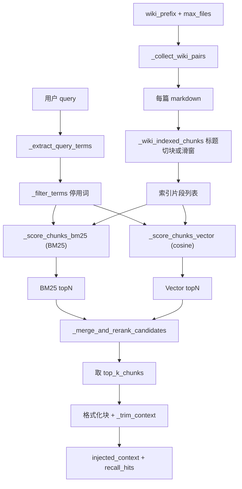
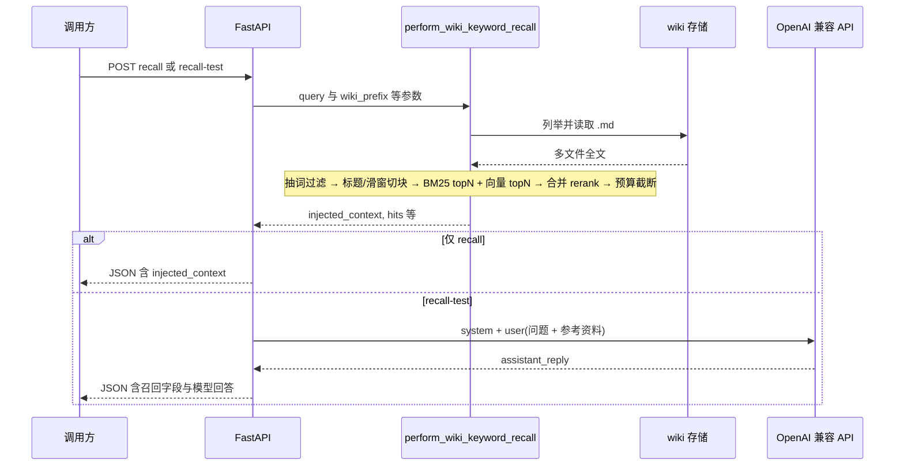

# pathy-knowledge-server

Karpathy 式知识库 **REST** 服务：**原始层 raw / 编译层 wiki / 规范层 schema**，OpenAPI 3 + Swagger UI，可选 Bearer 鉴权，OpenAI 兼容 Chat Completions。

## 项目简介

本服务实现「**Markdown 知识库**」的最小可部署形态：把素材放进原始层，在规范层约定下由 LLM 整理为带结构与交叉引用的编译层 wiki，并通过统一 REST 接口完成读写、编译与维护类任务。适合**本机单机**或**服务器单进程**部署，数据落在进程约定的本地目录，不依赖对象存储。

## 原理

| 概念 | 说明 |
|------|------|
| **原始层 `raw/`** | 未编译或半结构化来源（剪藏、摘录、上传的 Markdown/文本等），作为编译任务的输入。 |
| **编译层 `wiki/`** | 由 LLM 根据原始层与规范生成的 wiki 型 Markdown（索引、条目、交叉引用），编译任务写入目标。 |
| **规范层 `schema/`** | 约束目录、命名与 Agent 行为的说明（如 `AGENTS.md`），供服务与提示词引用；编译 / lint 前会注入或显式引用。 |

**数据流（闭环）**：向原始层写入素材 → 调用编译类接口 → 编译层出现对应条目与索引更新 → 可选 lint/报告类任务返回一致性说明。LLM 调用遵循 **OpenAI Chat Completions** 协议（`base_url` + `api_key` + `model`），便于切换兼容供应商。

**实现要点**：全部能力通过 **HTTP REST** 暴露；交互式 API 文档为 **OpenAPI 3 + Swagger UI**；持久化仅在 **`DATA_ROOT` 下本地文件系统** 内解析路径，禁止路径逃逸。

## 对话召回（`hybrid_bm25_vector`）

自然语言问句在 **wiki 编译层** 上做片段召回，实现见 `app/services/dialogue_recall.py`，停用词表见 `app/services/recall_stopwords.py`。接口：`POST /api/v1/dialogue/recall`（仅召回）、`POST /api/v1/dialogue/recall-test`（召回后拼进用户消息再调 LLM）。**不写回 wiki 文件**。

### 召回策略说明

- 采用 **BM25 + 模型向量** 双路召回：两路各取 `topN` 候选，再合并去重。  
- 向量路为 **Embedding 模型向量 + 余弦相似度检索**：query 在线生成向量，在本地向量索引中检索候选。  
- 去重后做 **轻量规则 rerank**（BM25 归一化分 + 向量归一化分 + 标题命中微调），再取最终 `topK` 注入上下文。  
- 仍按 **Markdown 标题层级** 切块并保留标题路径（如 `父 > 子`），兼顾结构化定位与可读性。

### 处理步骤（与代码对应）

1. **问句 → terms**（`_extract_query_terms` + `_filter_terms`）  
   正则切出中文连续段、英文数字连续段。英文数字段长度 ≥ 2 记为一个 term（小写）。中文：**不**再使用单字 term；长度 ≤ 8 的整段可成 term；更长中文再生成**相邻二字（bigram）**。然后经 **停用词表** 过滤（`recall_stopwords.STOPWORDS`）。

2. **读 wiki**（`_collect_wiki_pairs`）  
   在 `wiki_prefix` 下扫描 `*.md`（或单文件），最多 `max_files` 篇。

3. **全文 → 片段**（`_wiki_indexed_chunks`）  
   若文中存在 ATX 标题行（`#`…`######`），则按标题栈拆成多节，每节带 `heading_path`；节内过长仍用原 **滑窗**（`_split_chunks`）再切。若**无**标题，则整篇只走滑窗切块（`heading_path` 为空）。

4. **BM25 路召回**（`_score_chunks_bm25`）  
   以「`heading_path` + 正文」拼成匹配全文（小写子串计 TF），当次语料现算 DF/IDF，得到 BM25 分；标题路径命中按 IDF 做附加奖励。

5. **向量路召回（模型）**（`_score_chunks_vector_with_model`）  
   对 query 调用 Embedding 模型生成向量，再在向量索引中做余弦检索，得到向量路候选分。

6. **合并去重 + rerank + 截断**（`_merge_and_rerank_candidates` + `_trim_context`）  
   双路候选合并去重后做融合重排，取前 `top_k_chunks`，再按 `context_budget_chars` 块级截断。注入格式为 `### 文件相对路径` + 可选 `**标题路径**` + 正文。

7. **输出**  
   - `recall_method` 字段为 `hybrid_bm25_vector`。  
   - `query_terms` 为过滤停用词后实际参与打分的词项。  
   - `recall_hits[].score` 为融合重排得分（越大越相关）。

### 流程图



### 时序图（仅召回 vs 带 LLM）



## 快速开始

```bash
# 若当前不在项目目录，先进入：
# cd pathy-knowledge-server

python3 -m venv .venv
source .venv/bin/activate   # Windows: .venv\Scripts\activate
pip install -r requirements.txt
uvicorn app.main:app --host 0.0.0.0 --port 8765
```

> 如果命令行提示符已经是 `... pathy-knowledge-server %`，说明你已在该目录，无需再次执行 `cd pathy-knowledge-server`。

浏览器打开：`http://127.0.0.1:8765/docs`（Swagger）、`http://127.0.0.1:8765/health`。

## 重启服务

服务是 **Uvicorn 单进程**，修改了环境变量、`.env`、依赖或代码后，需要**停掉旧进程再启动**新进程才会生效（`get_settings()` 等也会在重启后重新加载）。

**前台运行**（终端里直接执行的 `uvicorn`）：在该终端按 **`Ctrl + C`** 结束进程，再执行与上文相同的 `uvicorn app.main:app ...` 命令。

**后台或占用端口时**（示例端口 `8765`，按你实际端口修改）：

```bash
# 按端口查 PID 并结束
lsof -i :8765
kill <PID>

# 或按命令行匹配进程结束（慎用多实例）
pkill -f "uvicorn app.main:app"

# 然后再前台启动；或用 nohup/systemd/docker compose 等你已有的托管方式拉起
```

确认重启的是**当前项目目录**下的虚拟环境与代码，避免旧目录或旧 Docker 镜像仍在运行。

## 向量嵌入与文件状态

wiki 层支持单文件手动嵌入（用于向量召回），接口：`POST /api/v1/wiki/embed`。

> 当前采用轻量本地索引实现（`DATA_ROOT/.pathy/wiki_embedding_index.json`），不依赖 Qdrant/Milvus/pgvector 等外部向量数据库。

- 每个 markdown 文件按标题层级与滑窗切为多个 chunk。
- 每个 chunk 生成 embedding 并写入向量索引（当前为 `DATA_ROOT/.pathy/wiki_embedding_index.json`）。
- 每个 chunk 保存元数据：`path`、`heading_path`、`updated_at`、`chunk_id`。
- wiki 文件有嵌入状态：`not_embedded` / `embedded`。
- wiki 文件内容变更或删除时，会同步清理该文件对应向量记录，避免脏索引。

## 环境变量（节选）

| 变量 | 说明 |
|------|------|
| `DATA_ROOT` | 数据根目录，默认 `./data`（相对进程工作目录） |
| `OPENAI_API_KEY` | LLM 密钥（不写入日志与响应） |
| `OPENAI_BASE_URL` | 可选，兼容网关 |
| `OPENAI_MODEL` | 默认模型名，默认 `gpt-4o-mini` |
| `EMBEDDING_API_KEY` | Embedding 独立密钥 |
| `EMBEDDING_BASE_URL` | Embedding 独立 Base URL |
| `EMBEDDING_MODEL` | Embedding 模型 ID |
| `EMBEDDING_TIMEOUT` | Embedding 超时（秒） |
| `EMBEDDING_MAX_TOKENS` | Embedding max_tokens |
| `RERANK_API_KEY` | Rerank 独立密钥 |
| `RERANK_BASE_URL` | Rerank 独立 Base URL |
| `RERANK_MODEL` | Rerank 模型 ID |
| `RERANK_TIMEOUT` | Rerank 超时（秒） |
| `RERANK_MAX_TOKENS` | Rerank max_tokens |
| `API_KEY` | 若设置，则 `/api/*` 需 `Authorization: Bearer <token>` |
| `CONFIG_FILE` | 可选 YAML 配置文件路径；同名字段可被环境变量覆盖 |

## 目录结构

在 `DATA_ROOT` 下自动创建：

- `raw/` — 原始层  
- `wiki/` — 编译层  
- `schema/` — 规范层（如 `AGENTS.md`）

运行时模型配置（可由 Web「模型配置」页写入）：

- `.pathy/llm.json` — LLM / Embedding / Rerank 三套运行时配置（**进程环境变量同名项优先**）
- `.pathy/openai_api_key` — LLM 可选密钥文件（权限尽量 `0600`）
- `.pathy/embedding_api_key` — Embedding 可选密钥文件（权限尽量 `0600`）
- `.pathy/rerank_api_key` — Rerank 可选密钥文件（权限尽量 `0600`）
- 连通性探测：
  - `POST /api/v1/settings/llm/test`
  - `POST /api/v1/settings/embedding/test`
  - `POST /api/v1/settings/rerank/test`

备份与迁移：复制整个 `DATA_ROOT` 目录即可。

## 安全说明

生产环境建议启用 `API_KEY` 并置于 HTTPS 反向代理之后；所有文件路径在数据根内规范化解析，禁止 `../` 逃逸。
